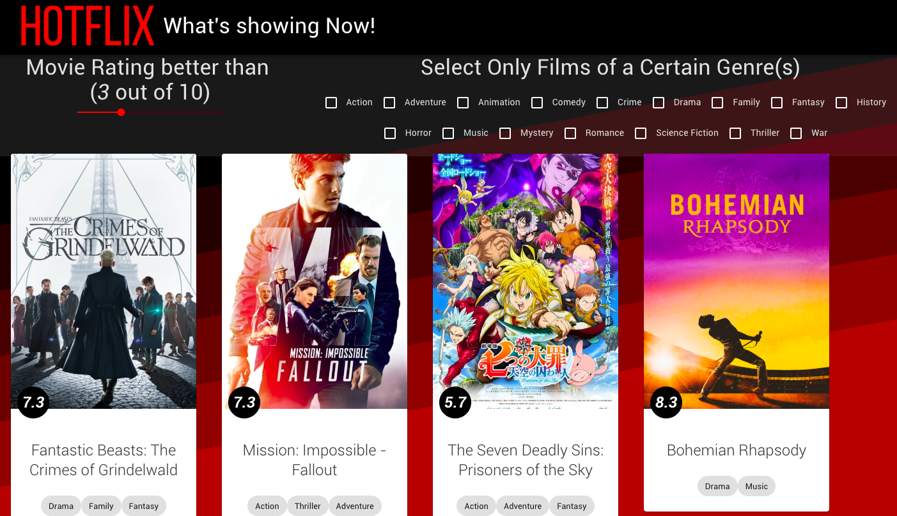

This is a Code Challenge for a TMDB Movie Listings Page that is written in React.

The project shows the now showing movies in the cinema from TMDB and allows users to filter by multiple genres and by rating

The project uses some Material UI components for displaying the results



## Requirements to run this Project

- A modern web browser like [Chrome](https://www.google.com/chrome/b/)

- An up to date version of [NodeJs](https://nodejs.org/en/download/) installed on your computer

## Quick Install from GitHub

```sh
git clone https://github.com/xoryco/moviechallenge.git
cd moviechallenge
npm install
npm start
```
The project should be visible on your browser at [http://localhost:3000](http://localhost:3000)

## How this Project Works 

The primary entrypoint of this React Project is App.js

When the App component loads, data is loaded into state from the TMDB Web APIs of Image Config, Current Movies, and Genres.

The full results of Movie are sorted by popularity.

An array of Movie Genres IDs are taken from the Movie results set and filtered for distinct values.

The Movie ID Genre Lists are compared to the Genre API results set and only genres within the movie results are kept. These values are used to create a series of Checkboxes so we can filter Movie results.

A Slider is used for selecting a desired Rating of between 0-10. When the slider is changed or a checkbox checked/unchecked a results method is run to generate an array of results. When genres are selected all of the selected genres have to be in the movie for that movie to be shown.

The Results array is displayed using the Movie.js Component.

The Movie component receives the Movie API data, image config and Genre name mapping as props.

The Movie component displays the Rating, Poster image, Title and Genres for the Movies in the results set using a vertical card format. 

Hope you like it!

## To Run this Project on your own machine

In the project directory, you can run:

### `npm start`

Runs the app in the development mode.<br>
Open [http://localhost:3000](http://localhost:3000) to view it in the browser.

The page will reload if you make edits.<br>
You will also see any lint errors in the console.

### `npm test`

Launches the test runner in the interactive watch mode.<br>
See the section about [running tests](https://facebook.github.io/create-react-app/docs/running-tests) for more information.

Currently no JEST/Enzyme tests have been set up.

### `npm run build`

You could build this but my lawyers are probably not as good as Netflix's 

## Suggested Improvements / Next Steps

- Set up tests in Jest 
- Refactor code so that Movie.js is a pure functional component

## Learn More

This project was bootstrapped with [Create React App](https://github.com/facebook/create-react-app).

You can learn more in the [Create React App documentation](https://facebook.github.io/create-react-app/docs/getting-started).

To learn React, check out the [React documentation](https://reactjs.org/).